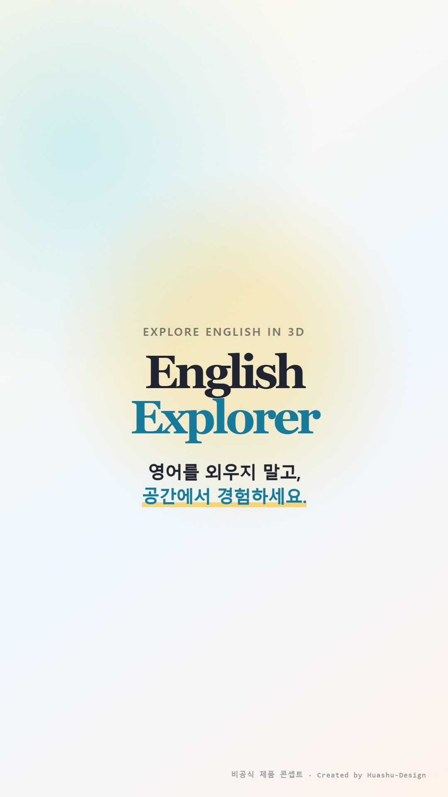
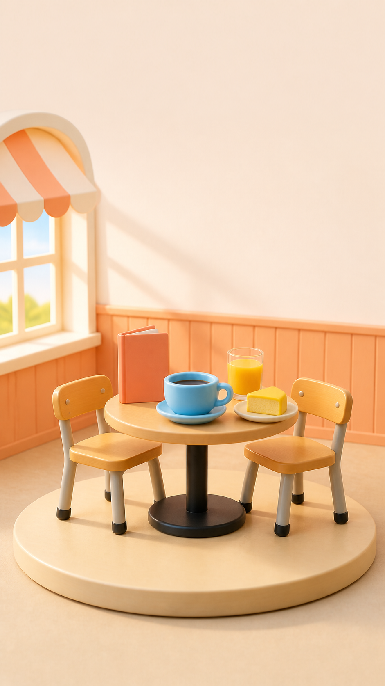

# 3D로 배우는 생활 영어 앱

초등학생을 위한 **인터랙티브 3D 영어 단어·문장 학습 앱**입니다.
교실 / 공항 / 카페 / 체크인 카운터 네 개의 장면 속 사물을 클릭하면
영어 단어, 발음(IPA), 한글 뜻, 예문이 뜨고 음성으로 들을 수 있습니다.
"문장 모드"에서는 21개 단어·예문에 더해, 3D 장면과 무관한 생활 영어
문장 14개(인사·자기소개·감사/사과·일상)까지 총 35개를 플래시카드로
복습할 수 있습니다. (예전에는 이 생활 문장 14개가 별도의 "영어 학습 앱
— 문장 플래시카드 편" 프로젝트였는데, 이 프로젝트로 통합됐습니다.)

Three.js 기반 3D 인터랙티브 씬에 클릭 핫스팟을 배치하는 구조로,
`thebuggeddev/anatomy`(3D 인체 탐색 앱)의 패턴을 영어 교육용으로 응용했습니다.

## 제품 콘셉트 영상

<p align="center">
  <a href="docs/product-film/media/english-explorer-product-film.mp4">
    
  </a>
</p>

교실에서 공항, 카페, 체크인 카운터까지 이동하며 사물을 선택하고
단어·IPA·한글 뜻·예문을 확인하는 학습 흐름을 파스텔 디오라마 스타일로
표현한 20초 세로형 제품 콘셉트 영상입니다.

- [60fps MP4 영상 보기](docs/product-film/media/english-explorer-product-film.mp4)
- [GIF 미리보기 보기](docs/product-film/media/english-explorer-product-film.gif)
- [제작 노트와 스토리보드](docs/product-film/README.md)

> 이 영상은 실제 배포 화면을 녹화한 자료가 아니라, 저장소 코드에서 확인한
> 장면·단어·예문·기능을 바탕으로 제작한 비공식 제품 콘셉트 영상입니다.

<table>
  <tr>
    <td align="center"><br /><strong>Classroom</strong></td>
    <td align="center"><br /><strong>Airport</strong></td>
  </tr>
  <tr>
    <td align="center"><br /><strong>Cafe</strong></td>
    <td align="center"><br /><strong>Check-in Counter</strong></td>
  </tr>
</table>

## 기술 스택

- Next.js 14 (App Router) + React 18 + TypeScript
- Three.js — 3D 씬 렌더링, 클릭 레이캐스팅
- GSAP — 카메라 이동 애니메이션
- Tailwind CSS — UI 스타일
- Web Speech API — 단어/예문 발음 (별도 API 키 불필요)
- Supabase (선택) — 학습 기록을 날짜별로 클라우드에 저장

## 시작하기

```bash
npm install
npm run dev
```

`http://localhost:3000` 에서 확인할 수 있습니다.

```bash
npm run build   # 프로덕션 빌드 검증
npm start       # 빌드된 앱 실행
```

## 온라인 DB 연동하기 (무료 — Supabase)

기본값은 이 브라우저의 localStorage에만 학습 기록을 저장하는
"로컬 저장 모드"입니다. Supabase를 연결하면 실제 클라우드 DB에
날짜별로 기록이 쌓입니다.

1. [supabase.com](https://supabase.com)에서 무료 프로젝트를 생성합니다.
2. SQL Editor에 [`supabase-schema.sql`](supabase-schema.sql) 내용을 붙여넣고 실행합니다.
3. `.env.local.example`을 `.env.local`로 복사하고, Supabase
   Project Settings → API에서 확인한 URL/anon key를 채워넣습니다.
4. 서버를 재시작하면 문장 모드 하단의 배지가 "Supabase 연결됨"으로 바뀝니다.

> ⚠️ **Claude Artifact로 배포한 `standalone/index.html`에서는 Supabase가
> 동작하지 않습니다.** Claude Artifact는 보안상 외부 네트워크 요청을 모두
> 차단하기 때문에, Artifact 안에서는 URL/key를 채워도 자동으로 "로컬 저장
> 모드"로 폴백됩니다. Supabase를 실제로 쓰려면 이 저장소를 Netlify, Vercel,
> GitHub Pages 등 자체 호스팅으로 배포해야 합니다.

## 프로젝트 구조

```
app/                  Next.js App Router 진입점
components/
  SceneExplorer.tsx    3D 씬 렌더링, 씬 전환, 클릭 인터랙션
  InfoPanel.tsx         선택한 단어의 정보 패널(발음 재생 포함)
  SentenceMode.tsx      전체 단어·문장을 복습하는 플래시카드 화면
  BrowserNotice.tsx     인앱 브라우저(카카오톡 등) 감지 배너
data/
  scenes.ts             4개 장면 × 5~6개 핫스팟(단어+문장) 데이터
  sentences.ts           3D 장면과 무관한 생활 영어 문장 14개
lib/
  models.ts              단어별 3D 모델 조립 로직
  speech.ts               모바일 대응 음성 재생 유틸
  db.ts                   Supabase/localStorage 학습 기록 저장·조회
supabase-schema.sql     Supabase에 붙여넣을 테이블 정의
```

## 콘텐츠 확장하기

`data/scenes.ts`의 `scenes` 배열에 새 장면 객체를 추가하거나,
기존 장면의 `hotspots` 배열에 항목을 추가하면 3D 씬과 문장 모드 양쪽에
자동으로 반영됩니다. 각 항목은 `word`(단어), `example`(예문),
`exampleKo`(예문 한글 번역)를 함께 채워야 문장 모드에 정상 표시됩니다.
3D 모델은 `lib/models.ts`에 물건별 조립 함수를 추가해서 그립니다.

## 배포

Vercel에 리포지토리를 연결하면 별도 설정 없이 바로 배포됩니다.

`standalone/index.html`은 Next.js/React/Three.js 없이 동작하는 단일 HTML
파일 버전입니다. Three.js 라이브러리를 빌드 시점에 인라인으로 포함하고
있어 서버 없이 파일 하나만 열어도 실행되며, Claude Artifact처럼 정적 HTML
한 장만 받는 공유 채널에 올릴 때 사용합니다. `app/`, `components/`,
`lib/`, `data/`의 원본 소스와는 별도로 관리되며 자동 동기화되지 않으므로,
장면/모델/문장을 수정하면 이 파일도 수동으로 다시 생성해야 합니다.
(Supabase 관련 제약은 위 "온라인 DB 연동하기" 섹션 참고)

## 다음 단계 아이디어

- 사용자 발음 녹음 후 정답 발음과 비교하는 미니게임
- 단어 퀴즈 모드(4지선다, 스펠링 게임)
- 지금은 기본 도형을 조합한 형태(lib/models.ts)로 표현 중 — 실제 glTF 3D 모델로 교체하면 더 사실적으로 표현 가능
- Supabase Auth로 로그인을 추가해 여러 기기 간 학습 기록 동기화
